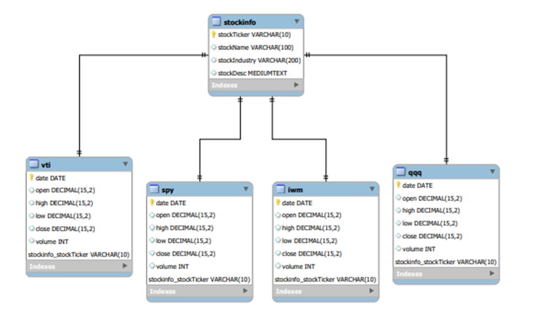

# CSCIX370 Term Project

##Team DataDawgs
### Authors
- Spencer King
- Daniel Abramow
- Shreenal Patel
##Project Description
This project is a unique take on something that has been done before many times.
The idea was to emulate a simple stock back tester. The back tester application allows
a user to test the gains or losses when investing in set of 4 exchange traded funds (ETFs) listed on the
right over a particular time frame.

This back tester allows a user to enter an amount to invest, select a time frame, then
select from 4 of the top ETFs in the world to invest in. The application will then calculate
the performance of the stock and of the investment over that particular time frame.

This can be particularly useful to analyze trends in different
sectors of the economy, correlate economic performance with specific events in history, and to
try to gain an understanding of future market performance based on past trends.

To develop this application, our team choose to use Java with Spring Boot framework and a mySQL database. 
In Spring Boot we choose to use the following dependencies: spring-boot-starter-jdbc 
to connect with our database, spring-boot-connector-java as our JDBC driver, 
spring-boot-thymeleaf to allow us to create premade html templates for our view, 
and also spring-boot-starter-web to help develop our UI. 

Our database is essentially the same as what was submitted in our preliminary assignment which was already
normalized after creation. Our database was structured in the following way:

For this application, we tried to stick to a MVC style architecture. Our view was handled with the help of 
Thymeleaf and Spring-web. This allowed us to create static html and css pages to allow the user to view our
data and interact with the application. The model or business layer was handled in several classes. The DOA 
class handled data access and two other classes Stock and StockInfo processed the data. Finally, we built a 
controller class to handle the flow of our application between the home page and stock page.

# Getting Started

## Sofware Requirements
- Have a Java Development Kit(JDK) installed on your machine (We recommend Amazon Corretto 11 )
  - [Link to Amazon Corretto](https://aws.amazon.com/corretto/)
- Make sure you have MySQL installed on your machine
  - [Link to MySQl Installation Documentation](https://dev.mysql.com/doc/mysql-getting-started/en/)
- Make sure you have Maven installed on your machine
  - [Link to Maven Installation Documentation](https://maven.apache.org/install.html)

## Dependencies
- [We are using Spring Boot framework so all initial dependencies 
  associated with the Spring Boot setup are used](https://docs.spring.io/spring-boot/docs/current/reference/html/)
- [spring-boot-starter-jdbc](https://spring.io/guides/gs/relational-data-access/)
- [mysql-connector-java](https://spring.io/guides/gs/relational-data-access/)
- [spring-boot-starter-web](https://spring.io/guides/gs/spring-boot/)
- [spring-boot-starter-thymeleaf](https://www.tutorialspoint.com/spring_boot/spring_boot_thymeleaf.htm)
- [spring-boot-maven-plugin](https://docs.spring.io/spring-boot/docs/current/maven-plugin/reference/htmlsingle/)

## To run
1. Download the project files from [GitHub](https://github.com/sking115422/CSCIX370_TermProject) or use the files provide on eLC and extract the .zip file to a local folder.
2. After extraction go into the following file src/main/resources/application.properties and update the username and password values for your database.
3. Run the run_project.py file. This should set up the databases associated in MySQL after prompting you for your username (probably root) and a password, 
   compile and run the project code, and finally after a few seconds it should open a browser with the home page of the app displaying.
4. If the browser does not automatically display, open a browser and type "http://localhost:8080/". This should navigate you to the homepage of the project.
5. From here enter a time frame, an amount of money to invest, and choose from one of the 4 ETF options available. 
   This should take you a new page displaying all data associated with that particular investment.

